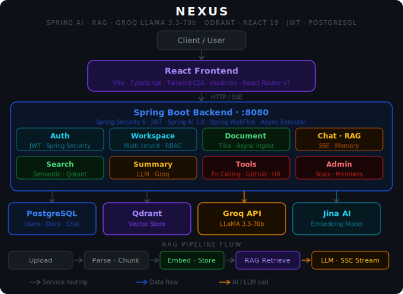

# ⚡ NEXUS (Neural Enterprise Knowledge Unification System) — AI-Powered Workspace Intelligence Platform

> Upload documents. Chat with them. Search semantically. Get AI summaries. All within secure, multi-member workspaces.


---

## Architecture



---

## What is NEXUS?

**NEXUS** stands for *Neural Enterprise Knowledge Unification System*.

NEXUS is a full-stack AI workspace platform where teams can upload documents (PDF, DOCX, TXT), chat with them using Retrieval-Augmented Generation (RAG), run semantic searches across workspace documents, and get AI-powered summaries — all within isolated, role-protected workspaces.

It is built on top of **Spring AI 1.0.0**, uses **Groq's LLaMA 3.3-70b** model for generation, **Jina AI** for document embeddings, and **Qdrant** as the vector store. The frontend is a React 19 + TypeScript SPA with real-time SSE streaming for chat responses.

---

## ✨ Features

- 🧠 **RAG-Based Document Chat** — Ask questions over your uploaded documents; answers are grounded in actual content via Qdrant similarity search
- 🔍 **Semantic Search** — Search workspace documents by meaning, not just keywords
- 📄 **Document Ingestion** — Upload PDF, DOCX, or TXT files; parsed with Apache Tika and embedded with Jina AI
- ⚡ **Streaming Chat** — Responses stream in real time via Server-Sent Events (SSE)
- 🗂️ **Multi-Workspace Support** — Create isolated workspaces, invite members, manage access
- 💬 **Persistent Chat Memory** — JDBC-backed Spring AI chat memory stored in PostgreSQL per session
- 📝 **AI Document Summary** — Generate summaries of ingested documents via Groq LLaMA
- 🛠️ **Function Calling Tools** — GitHub repo info + HR employee tools via Spring AI tool calling
- 🔐 **JWT Authentication** — Stateless auth with access + refresh tokens via Spring Security 6
- 👤 **Role-Based Access** — ADMIN and MEMBER roles with workspace-scoped security

---

## 🛠️ Tech Stack

### Backend

| Technology | Purpose |
|---|---|
| Java 17 | Core language |
| Spring Boot 3.3.5 | Backend framework |
| Spring AI 1.0.0 | AI integration (RAG, embeddings, tools, chat memory) |
| Groq API (LLaMA 3.3-70b) | LLM for chat generation and summarization |
| Jina AI (jina-embeddings-v2-base-en) | Document embedding model |
| Qdrant Vector Store | Vector similarity search |
| Spring Security 6 + JWT | Authentication and authorization |
| Spring WebFlux | SSE streaming for chat responses |
| Apache Tika | Document parsing (PDF, DOCX, TXT) |
| Spring Data JPA + Hibernate | ORM and database access |
| PostgreSQL | Relational database |
| Lombok | Boilerplate reduction |
| Docker + Docker Compose | Infrastructure (PostgreSQL + Qdrant) |

### Frontend

| Technology | Purpose |
|---|---|
| React 19 | UI framework |
| TypeScript 5.7 | Type-safe frontend development |
| Vite 8 | Build tool and dev server |
| Tailwind CSS v4 | Utility-first styling |
| shadcn/ui + Radix UI | UI component primitives |
| React Router DOM v7 | Client-side routing |
| Axios | HTTP client with JWT interceptor |
| Custom SSE Hook | Real-time streaming chat |

---

## 🚀 Getting Started (Local Setup)

### Prerequisites

- Java 17+
- Node.js 18+
- Docker + Docker Compose
- Groq API key — [console.groq.com](https://console.groq.com) (free)
- Jina AI API key — [jina.ai](https://jina.ai) (free tier available)

---

### 1. Clone the repository

```bash
git clone https://github.com/ritik-hedau18/NEXUS.git
cd NEXUS
```

### 2. Start infrastructure

```bash
docker-compose up -d
```

Starts PostgreSQL on `:5432` and Qdrant on `:6333` / `:6334`.

### 3. Configure environment variables

```bash
cp backend/.env.example backend/.env
```

Fill in `backend/.env`:

```env
DB_USERNAME=postgres
DB_PASSWORD=your_db_password
GROQ_API_KEY=your_groq_api_key
JINA_API_KEY=your_jina_api_key
QDRANT_HOST=localhost
JWT_SECRET=your_256bit_hex_encoded_secret
```

Set these in your IDE run configuration (IntelliJ: Run → Edit Configurations → Environment Variables) or export them in your shell.

### 4. Run the backend

```bash
cd backend
./mvnw spring-boot:run
```

Backend starts at `http://localhost:8080`

### 5. Run the frontend

```bash
cd nexus-frontend
npm install
npm run dev
```

Frontend starts at `http://localhost:5173`

---

## 🔌 API Reference

### Auth Endpoints

| Method | Endpoint | Description | Auth Required |
|---|---|---|---|
| POST | `/api/auth/register` | Register a new user | ❌ |
| POST | `/api/auth/login` | Login, returns JWT tokens | ❌ |
| POST | `/api/auth/refresh` | Refresh access token | ❌ |

### Workspace Endpoints

| Method | Endpoint | Description | Auth Required |
|---|---|---|---|
| GET | `/api/workspaces` | List user's workspaces | ✅ |
| POST | `/api/workspaces` | Create a workspace | ✅ |
| POST | `/api/workspaces/{id}/members` | Add member to workspace | ✅ |
| DELETE | `/api/workspaces/{id}/members/{userId}` | Remove member | ✅ |

### Document Endpoints

| Method | Endpoint | Description | Auth Required |
|---|---|---|---|
| POST | `/api/documents/upload` | Upload and ingest a document | ✅ |
| GET | `/api/documents` | List documents in workspace | ✅ |
| DELETE | `/api/documents/{id}` | Delete a document | ✅ |

### AI Endpoints

| Method | Endpoint | Description | Auth Required |
|---|---|---|---|
| GET | `/api/chat/stream` | SSE streaming RAG chat | ✅ |
| GET | `/api/chat/history` | Get chat history for session | ✅ |
| GET | `/api/search` | Semantic search over documents | ✅ |
| POST | `/api/summary/{documentId}` | Generate document summary | ✅ |

### Admin Endpoints

| Method | Endpoint | Description | Auth Required |
|---|---|---|---|
| GET | `/api/admin/workspaces/stats` | Workspace statistics | ✅ ADMIN |
| GET | `/api/admin/members` | All workspace members | ✅ ADMIN |

---

## 🔒 Security

- Passwords hashed using **BCrypt**
- JWT access token expires in **1 hour**, refresh token in **24 hours** (configurable)
- All endpoints except `/api/auth/**` require a valid Bearer JWT
- Workspace-scoped security — members can only access their own workspace data
- Spring Security 6 with stateless session (no HttpSession)
- Sensitive config (API keys, JWT secret) kept out of source via environment variables

---

## 🗄️ Database Schema

| Table | Purpose |
|---|---|
| `users` | User accounts with roles (ADMIN / MEMBER) |
| `workspaces` | Workspace definitions with owner reference |
| `workspace_members` | Many-to-many workspace-user membership |
| `documents` | Document metadata with ingestion status (PROCESSING / READY / FAILED) |
| `chat_messages` | Chat history per session and workspace |
| `employees` | Mock HR employee data for function calling demo |
| `SPRING_AI_CHAT_MEMORY` | Spring AI JDBC-backed persistent chat memory |

---

## 👤 Author

**Ritik Hedau**
Java Full Stack Developer | Spring Boot | Spring AI | React
📍 India

[](https://github.com/ritik-hedau18)

---

## 🔗 Related Projects

| Project | Description |
|---|---|
| [SRIJAN](https://github.com/ritik-hedau18/SRIJAN) | AI-powered Spring Boot code generator using Groq LLaMA + Spring AI |
| [TRACE](https://github.com/ritik-hedau18/TRACE-Transaction-Risk-and-Anomaly-Classification-Engine) | Real-time fraud detection system using Spring Boot microservices + Kafka |

---

## 📄 License

This project is open source and available under the [MIT License](LICENSE).
